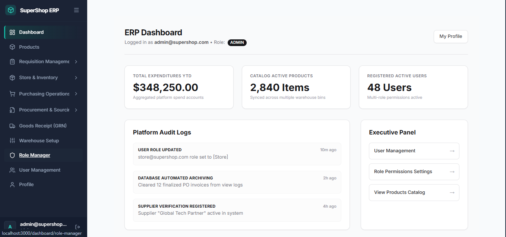
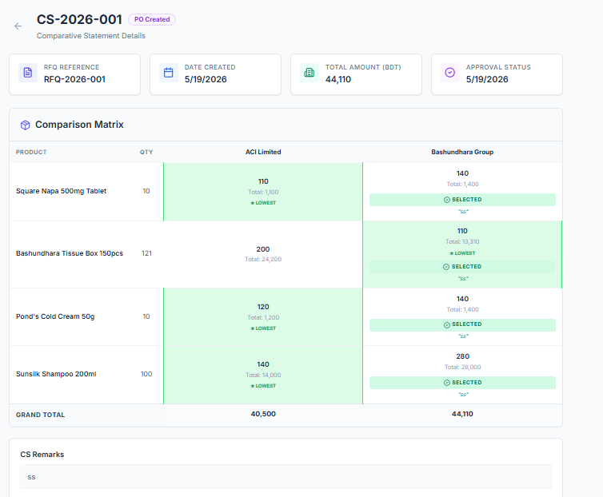
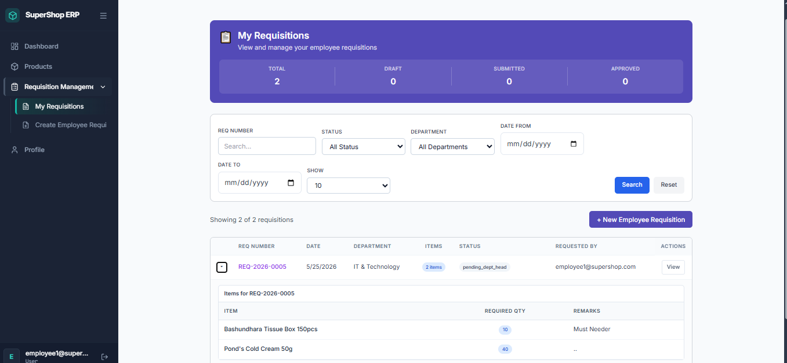
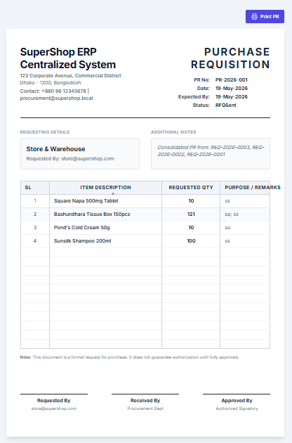
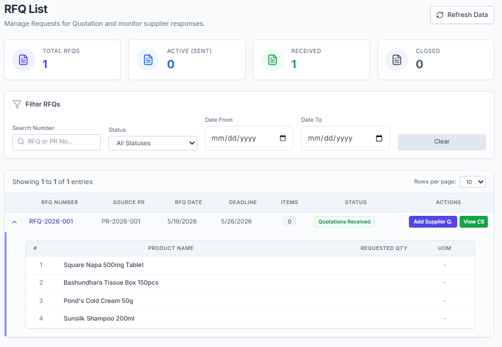
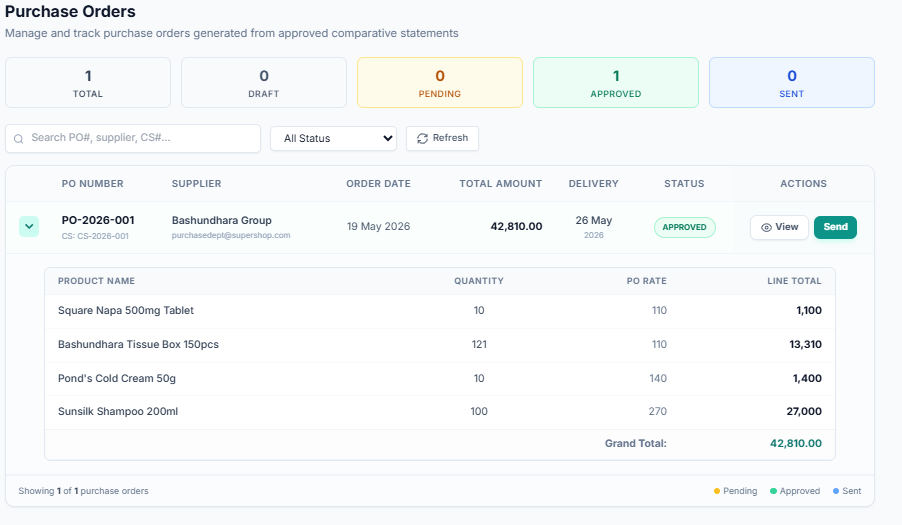

# 🌐 SupplyChain-ERP-Frontend-React

<div align="center">
  
  
  
  
  
</div>

---

## 📖 Project Overview
This repository contains the **Frontend Application** for an enterprise-grade Supply Chain and ERP system. Built as a Single Page Application (SPA) using **React**, **TypeScript**, and **Vite**, it provides a lightning-fast, highly responsive, and intuitive user interface. It seamlessly consumes the underlying ASP.NET Core Web API to handle complex procurement lifecycles, dynamic inventory tracking, and master data management.

*(To view the Backend REST API architecture, please check the interconnected backend repository in my profile).*

---

## 🚀 Key Features & UI Workflows

- **Role-Based Dynamic Routing:** Secure routing system that dynamically renders sidebars and pages based on user roles (Admin, Purchase Manager, Store Manager, etc.).
- **Complex Form Handling:** Multi-step workflows for Employee Requisitions, Purchase Orders (PO), and Goods Receipt Notes (GRN).
- **Algorithmic Data Visualization:** Interactive implementation of the Comparative Statement (CS) module, comparing multi-vendor bids side-by-side.
- **State Management:** Efficient global state handling utilizing React Context API and custom hooks.
- **Modern UI/UX:** Fully responsive design crafted with **Tailwind CSS** and **Lucide React** icons for a clean, corporate feel.
- **Optimized API Integration:** Centralized API services using **Axios** with global interceptors for JWT token management and error handling.

---

## 📸 UI Showcases (Sneak Peek)
*Click on the dropdowns below to expand the application screenshots:*

<details>
  <summary><b>📊 1. Interactive Dashboard</b></summary>
  <br/>
  
</details>

<details>
  <summary><b>⚖️ 2. Comparative Statement (CS)</b></summary>
  <br/>
  
</details>

<details>
  <summary><b>📝 3. Employee Requisition & PR</b></summary>
  <br/>
  
  <br/><br/>
  
</details>

<details>
  <summary><b>📦 4. Procurement (RFQ & PO)</b></summary>
  <br/>
  
  <br/><br/>
  
</details>

---

## 📂 Project Structure Snapshot
```text
📁 src
 ├── 📁 assets        # Static media and global styles
 ├── 📁 components    # Reusable UI components (Buttons, Modals, Tables)
 ├── 📁 context       # React Context providers for global state
 ├── 📁 hooks         # Custom React hooks
 ├── 📁 layouts       # Master layouts (Sidebar, Header, Protected Layout)
 ├── 📁 pages         # Core application pages (Dashboard, Procurement, Store)
 ├── 📁 services      # Axios API configuration and endpoint calls
 ├── 📁 utils         # Helper functions and formatters
 ├── 📄 App.tsx       # Root component and Router configuration
 └── 📄 main.tsx      # Application entry point
